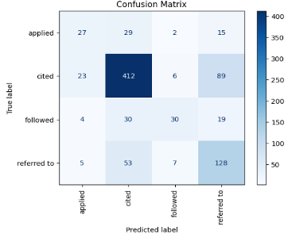

# LawDigestAI

## Project Overview

**LawDigestAI** is a deep learning-based project designed to streamline legal text analysis using Australian Federal Court case data. The project focuses on two key tasks: Summarizing and Classifying Legal Case Reports

1. **Catchphrase Extraction**: Automatically extracting concise summaries of legal cases to highlight critical legal principles and decisions.
2. **Citation Classification**: Classifying relationships between cited legal cases (e.g., "applied," "cited," "referred to") to assist in understanding legal precedents.

This work aims to enhance legal professionals' efficiency by providing meaningful insights from lengthy case documents.


## Dataset Information

- **Dataset Source**: Federal Court of Australia (FCA) cases (2006–2009) sourced from AustLII.
- **Dataset Characteristics**:
  - Includes case full text, catchphrases, and citation details.
  - Contains 3,890 legal cases with over 1.8 million catchphrases and 25,256 citation records.
  - [Dataset Link](https://archive.ics.uci.edu/dataset/239/legal+case+reports)


## Repository Structure

```
LawDigestAI/
│
├── 1_Governance/
│   ├── images/
│   ├── Project Proposal.docx
│   ├── Project Proposal.pdf
│   ├── IST_691_Deep_Learning_Project_Report.docx
│   ├── PPT.pptx
│   ├── Architecture_diagram.png
│
├── 2_Generation/
│   ├── catchphrase_Extraction/
│   │   ├── t5-catchphrase-extraction-model/
│   │   ├── preprocessed_summ_data.csv
│   │   ├── test_data.csv
│   │   ├── training_data.csv
│   ├── citation_classification/
│       ├── legalbert-citation-model/
│
├── 3_Collection_and_Standardization/
│   ├── citation_classes_parser.py
│   ├── fulltext_parser.py
│
├── 4_Aggregation/
│   ├── DataCleaning.ipynb
│   ├── flatten_classes.py
│
├── 5_Analysis/
│   ├── catchphrase_extraction/
│   │   ├── DataPreprocessing.ipynb
│   │   ├── ModelTraining.ipynb
│   │   ├── PromptEngineering.ipynb
│   ├── citation_classification/
│   │   ├── MCC_LegalBERT.ipynb
│   ├── model_output_func.py
│
├── 6_Application/
│   ├── app.py
│   ├── citation_class_visuals.ipynb
│   ├── fulltext_visuals.ipynb
│
└── README.md

```

## Workflow and Methods

### Preprocessing
- Fixed broken XML structures and parsed the data.
- Filtered and cleaned raw data:
  - Limited word counts and tokens for text and catchphrases.
  - Extracted limited citations for classification.

### Task 1: Catchphrase Extraction
1. **Preprocessing**:
   - Generated sentence embeddings for input text and catchphrases.
   - Filtered using cosine similarity and token limits to meet T5 model constraints.
2. **Model Training**:
   - Fine-tuned T5-small model for summarization.
   - Evaluated performance using ROUGE metrics.
   - Evaluation Metric: ROUGE Scores for Summarization Task: rouge1: 0.351, rouge2: 0.156, rougeL: 0.271, rougeLsum: 0.272s
   
3. **Prompt Engineering**:
   - Best-performing prompt: **Generate an abstract list of important phrases that summarize the case document:**

### Task 2: Citation Classification
1. **Model Training**:
   - Fine-tuned LegalBERT for citation relationship classification.
   - Evaluation Metric: F1 Score: 0.693, Accuracy: 0.6985

### Application
- **Streamlit App**:
  - Two tabs for the tasks.
  - Allows input of text and generates outputs using the trained models.
  -   
- Backend scripts (folder `5_Analysis`) handle model outputs.


## Visualizations
- Generated visual insights for both tasks using `6_Application` notebooks.
- Includes citation class distributions and catchphrase text characteristics.


## Methodology


## Results and Metrics

#### Catchphrase Extraction - Training and Validation Loss


#### Catchphrase Extraction - Training Loss and Confusion Matrix




## Setup Instructions

### Requirements
- Python >= 3.8
- [Install dependencies](2_Generation/requirements.txt)

### Running the Project
1. Clone the repository:
   ```bash
   git clone https://github.com/Rishi-28/LawDigestAI.git
    ```
### Install dependencies:
```bash
pip install -r requirements.txt
```

## Launch the app:
```bash
streamlit run 6_Application/app.py
```

## Demo Video
[Demo Video](1_Governance/demo_video.webm)

## Contributors
- Rishikesh Ramesh
- Nithish Kumar Senthil Kumar


## Contact
For any queries, please reach out to:

- Email: r.rishikesh2870@gmail.com
- LinkedIn: [rishikesh2809](https://www.linkedin.com/in/rishikesh2809/)
